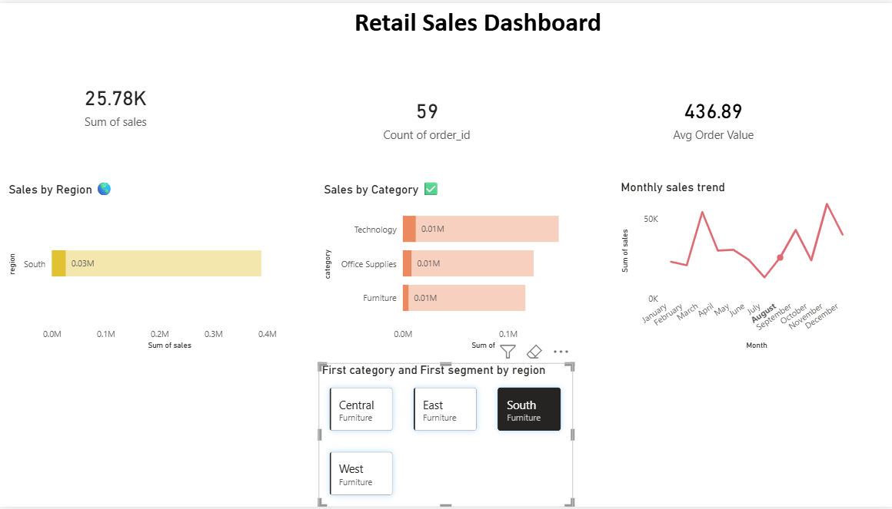

# Retail Sales Data Analysis Dashboard

## Project Overview
This project focuses on analyzing retail sales data using Python, SQL, and Power BI to extract meaningful business insights and build an interactive dashboard for decision-making.

The analysis includes:
- Data Cleaning
- Exploratory Data Analysis (EDA)
- SQL-based Analysis
- Interactive Power BI Dashboard

---

# Objectives
- Analyze retail sales performance
- Identify sales trends across regions and categories
- Understand customer purchasing behavior
- Build an interactive business dashboard
- Generate business insights for better decision-making

---

# Tools & Technologies Used
- Python
- Pandas
- NumPy
- Matplotlib
- SQL
- SQLite
- Power BI
- Jupyter Notebook

---

# Dataset Features
The dataset contains:
- Order Details
- Customer Information
- Product Categories
- Sales Data
- Regional Information
- Shipping Information

---

# Data Cleaning Process
Performed using Python and Pandas:
- Removed duplicate rows
- Handled missing values
- Converted date columns
- Standardized column names
- Prepared dataset for analysis and visualization

---

# Exploratory Data Analysis (EDA)
The following analyses were performed:
- Total Sales Analysis
- Regional Sales Analysis
- Category-wise Sales Analysis
- Monthly Sales Trends
- Customer-wise Sales Analysis
- Average Order Value Analysis

---

# Power BI Dashboard Features

## KPI Cards
- Total Sales
- Total Orders
- Average Order Value

## Visualizations
- Sales by Region
- Sales by Category
- Monthly Sales Trend
- Region-wise Interactive Filtering

## Interactive Features
- Dynamic filtering by region
- Interactive visual analysis
- Comparative sales insights

---

# Key Insights
- Technology category generated the highest sales.
- Western region showed strong sales performance.
- Monthly sales trends indicate seasonal fluctuations.
- Average order value varied significantly across regions.

---

# Dashboard Preview

## Main Dashboard


---

# Project Structure

```text
Retail-Sales-Data-Analysis/
│
├── data/
│   ├── retail_sales.csv
│   └── cleaned_retail_sales.csv
│
├── notebooks/
│   ├── data_cleaning.ipynb
│   ├── eda_analysis.ipynb
│   └── sql.ipynb
│
├── dashboard/
│   └── Retail_Sales_Dashboard.pbix
│
├── database/
│   └── sales.db
│
├── images/
│   └── dashboard.png
│
├── README.md
